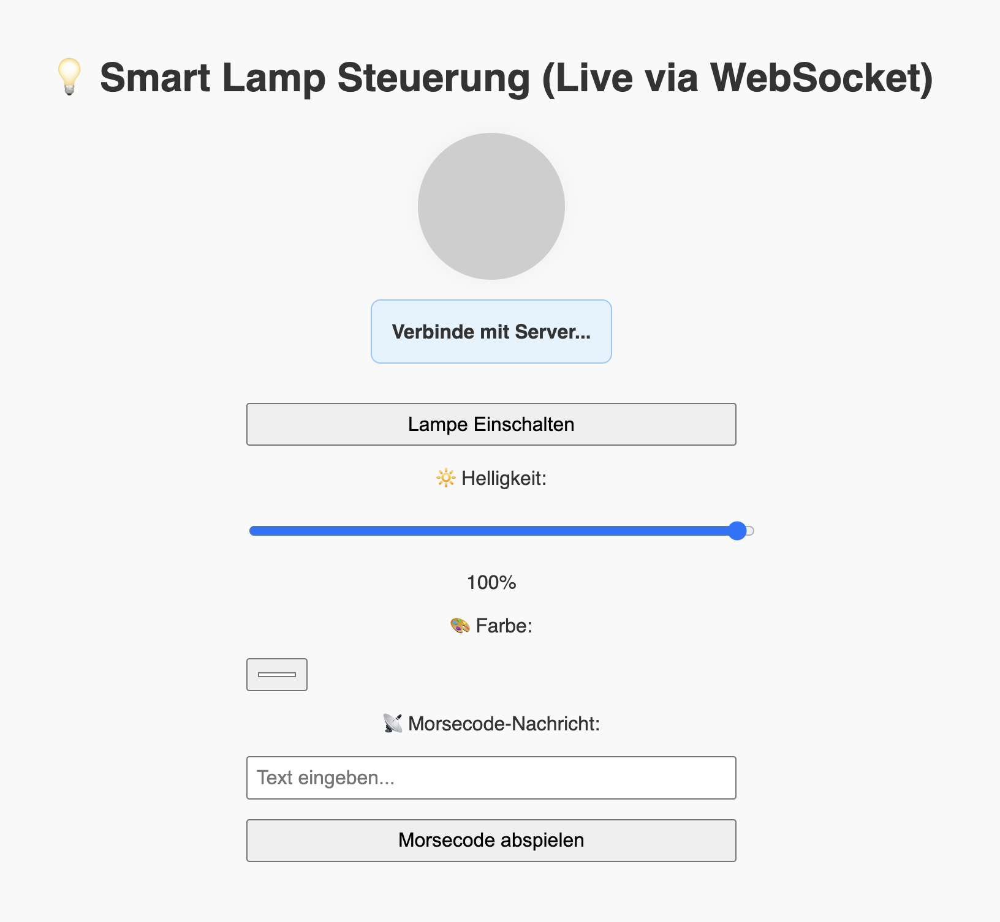

## How to Use

Die Applikation ist Containerisiert und muss deshalb mittels Docker-Compose gestartet werden. Dazu muss folgendes ausgeführt werden:

### 1. Env

Env anlegen nach diesem Schema anlegen und /dilmand_tom_felix ablegen.

```env
RABBITMQ_DEFAULT_USER=guest
RABBITMQ_DEFAULT_PASS=guest
TPLINK_EMAIL= <TP_MAIL>
TPLINK_PASSWORD=<TP_PASSWORT>
TPLINK_DEVICE_IP=<TP_DEVICE_ID>
```


### 2. Verbinden der Lampe

1. Hotspot/WLAN öffnen (min. 2,4 Ghz).
2. Die Lampe und Gerät der Anwendung mit dem WLAN verbinden.
3. Lampe mit der App verbinden.
4. Die entsprechenden Credentails in der .env eintragen.

### 3. Docker-Compose starten

```sh
docker-compose build
docker-compose up
```
Durch Aufrufen der entsprechenden Web-UI unter [http://localhost:8080](http://localhost:8080), können die erwünschten Funktionalitäten der Lampe angesteuert werden.
Daruter fallen: Ein-/Ausschalten, Farbänderungen, Anpassung der Helligkeit, sowie Darstellung eines Wortes mittels Morse-Code.

## Vorschau UI




## Assignees
Dilmand Saado (MtrNr. 9511296)
Tom Weber (MtrNr. 1705171)
Felix Erhard (MtrNr. 3394927)